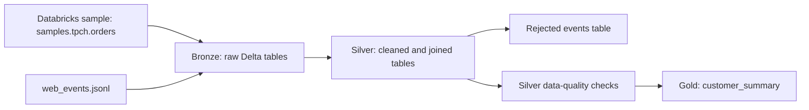
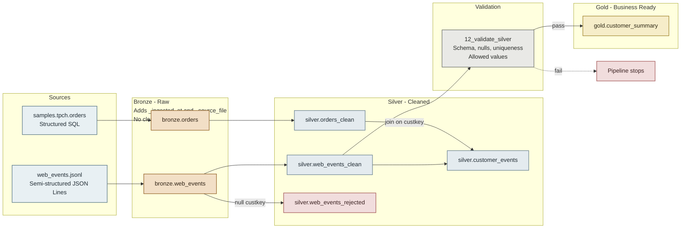
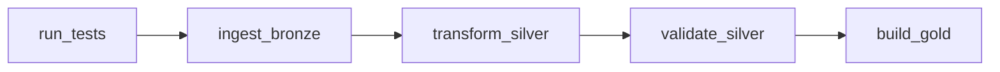

# Lakehouse Forge

An ETL learning project that turns structured order data and semi-structured web events into validated, business-ready customer metrics with PySpark, Delta Lake, and Databricks Workflows.

## Overview

Data from different systems arrives in different formats and may contain duplicates, missing keys, inconsistent dates, or values that need normalization. Lakehouse Forge demonstrates a layered workflow for ingesting that data, preserving the raw inputs, cleaning and validating them, and publishing customer-level aggregates.

The notebooks show the Databricks workflow, while reusable transformation and validation logic lives in `src/` and unit tests live in `tests/`. Bronze keeps the raw data replayable, Silver makes it trustworthy, and Gold makes it ready to query.

## Technology Stack

- Python and PySpark
- SQL
- Databricks notebooks, volumes, and Workflows
- Databricks Free Edition with serverless compute
- Delta Lake tables and constraints
- PyTest
- Git

## Architecture



The pipeline follows the medallion pattern:

Sources -> Bronze -> Silver -> Validation -> Gold



1. **Bronze** keeps source data with ingestion metadata.
2. **Silver** cleans the web events and orders, stores invalid web events separately, and joins event records with order history.
3. **Validation** checks the cleaned Silver event table before the Gold aggregation is built.
4. **Gold** publishes one summary row per customer.

## Data Sources

| Source | Format | Contents |
| --- | --- | --- |
| `samples.tpch.orders` | Structured SQL table | Order history from the Databricks sample dataset |
| `data/web_events.jsonl` | Semi-structured JSON Lines | Sample page views, purchases, and refunds |

In Databricks, the JSON Lines file is read from the `workspace.bronze.raw_files` volume. The sample file in `data/` must be uploaded to that volume before ingestion.

## Pipeline Layers

### Bronze

Bronze tables are raw copies of their source data, with ingestion metadata added:

- `workspace.bronze.orders` is created from `samples.tpch.orders` and receives `_ingested_at`.
- `workspace.bronze.web_events` is loaded from the JSON Lines file and receives `_ingested_at` and `_source_file`.
- Source records are not cleaned in this layer.

The SQL source does not currently add `_source_file`; that metadata column is added to the JSON source.

### Silver

- `workspace.silver.web_events_clean` excludes events with a null `custkey`, removes duplicate `event_id` values, casts `amount` to `decimal(10,2)`, then widens it to `decimal(12,2)` because `coalesce` replaces null amounts with a literal integer zero, and parses `event_time` after replacing `/` with `-`.
- `workspace.silver.web_events_rejected` retains events with a null `custkey`. Bad rows are kept aside, not deleted from the workflow.
- `workspace.silver.orders_clean` filters orders without order or customer keys, deduplicates on `o_orderkey`, and retains the selected order fields.
- `workspace.silver.customer_events` left-joins cleaned events to per-customer order counts and order values.

### Gold

`workspace.gold.customer_summary` is aggregated from `workspace.silver.customer_events`, with one row per `custkey`. It contains:

| Column | Meaning |
| --- | --- |
| `custkey` | Customer key |
| `total_events` | Number of web events |
| `page_views` | Number of page-view events |
| `purchases` | Number of purchase events |
| `refunds` | Number of refund events |
| `net_web_revenue` | Sum of event amounts, including negative refunds |
| `lifetime_orders` | Number of orders for the customer |
| `lifetime_order_value` | Total value of the customer's orders |
| `last_activity` | Timestamp of the customer's most recent event |

## Data Quality

The project demonstrates checks at both the DataFrame and Delta table levels.

### PySpark validation

`src/validate.py` provides four checks used by `12_validate_silver.ipynb`:

- **Schema:** verifies that the expected columns exist and have their expected types. The current helper checks the expected fields; it does not fail solely because additional columns are present.
- **Nulls:** checks required columns for null values.
- **Uniqueness:** checks that a key column has no duplicates.
- **Allowed values:** checks that a column contains only values from an allowed set, currently `page_view`, `purchase`, or `refund` for `event_type`.

### Delta constraints and schema enforcement

`04_data_integrity.ipynb` demonstrates Delta `NOT NULL` constraints on `event_id` and `custkey`, plus a `CHECK` constraint limiting `event_type` to the allowed event types. These constraints live with the Delta table. The integrity notebook is separate from the five-task workflow described below, so run it when you want to apply or demonstrate those constraints; it is not automatically run by that workflow.

Delta schema enforcement also rejects writes whose columns do not match the target table. The integrity notebook demonstrates this with a write containing `foo` and `bar` columns.

## Tests

The PyTest suite focuses on the semi-structured web-event cleaning logic. Structured order cleanup currently happens inline in `11_transform_silver.ipynb` and does not have corresponding PyTest cases.

The five unit tests in `tests/test_transform.py` cover:

1. Duplicate event removal.
2. Null customer keys being routed to the rejected events DataFrame.
3. Null amounts becoming zero.
4. Negative refund amounts being retained.
5. Two supported date formats resolving to the same timestamp.

`tests/conftest.py` supplies a session-scoped Spark fixture. `05_run_tests.ipynb` invokes `pytest.main(...)` against the `tests/` directory and fails the notebook task if the test run fails. PyTest is an installed package in the Databricks environment, not a project source file; install it in the cluster with `%pip install pytest` if it is not already available.

At a high level, the test run loads `conftest.py`, imports the tests and transformation functions, creates test DataFrames with the Spark fixture, and checks the outputs against expected behavior.

## Databricks Workflow

The Databricks job is named `lakehouse-forge-etl`. The job has five dependent tasks in this order, runs daily, and sends an email on failure:



| Order | Task | Notebook | Purpose |
| --- | --- | --- | --- |
| 1 | `run_tests` | `05_run_tests.ipynb` | Run the PyTest unit suite |
| 2 | `ingest_bronze` | `10_ingest_bronze.ipynb` | Refresh the Bronze order and event tables |
| 3 | `transform_silver` | `11_transform_silver.ipynb` | Clean and join data into Silver tables |
| 4 | `validate_silver` | `12_validate_silver.ipynb` | Run the Silver data-quality checks |
| 5 | `build_gold` | `13_build_gold.ipynb` | Create the customer summary table |

The job configuration is managed in Databricks and is not currently included as a configuration file in this repository.

## Project Structure

```text
lakehouse-forge/
├── config/                         # Reserved for pipeline settings
├── data/
│   └── web_events.jsonl            # Sample semi-structured source data
├── notebooks/
│   ├── 01_bronze_ingestion.ipynb    # Initial workspace/schema/volume setup and ingestion exploration
│   ├── 02_silver_transformation.ipynb
│   ├── 03_gold_aggregation.ipynb
│   ├── 04_data_integrity.ipynb      # Delta constraints and schema enforcement examples
│   ├── 05_run_tests.ipynb           # PyTest workflow task
│   ├── 10_ingest_bronze.ipynb       # Bronze workflow task
│   ├── 11_transform_silver.ipynb    # Silver workflow task
│   ├── 12_validate_silver.ipynb     # Validation workflow task
│   └── 13_build_gold.ipynb          # Gold workflow task
├── src/
│   ├── __init__.py                 # Makes src importable
│   ├── transform.py                # Web-event cleaning and rejection logic
│   └── validate.py                 # Reusable DataFrame validation checks
└── tests/
	├── conftest.py                 # Spark fixture for tests
	└── test_transform.py           # Web-event transformation unit tests
```

## Getting Started

1. Clone this repository and add it to your Databricks workspace as a Git folder.
2. In `01_bronze_ingestion.ipynb`, run the setup cells that create the `workspace.bronze`, `workspace.silver`, and `workspace.gold` schemas and the `workspace.bronze.raw_files` volume.
3. Upload `data/web_events.jsonl` to the `workspace.bronze.raw_files` volume.
4. Configure or open the `lakehouse-forge-etl` job and run it. The job runs tests, ingestion, transformation, validation, and Gold aggregation in dependency order.

The notebooks use Databricks sample data and workspace objects, so they are intended to run in a Databricks environment with access to `samples.tpch.orders`.

## Results

The workflow produces these tables:

- Bronze: `workspace.bronze.orders`, `workspace.bronze.web_events`
- Silver: `workspace.silver.web_events_clean`, `workspace.silver.web_events_rejected`, `workspace.silver.orders_clean`, `workspace.silver.customer_events`
- Gold: `workspace.gold.customer_summary`

- Bronze `web_events`: 7 rows
- Silver `web_events_clean`: 5 rows
- Silver `web_events_rejected`: 1 row
- Gold `customer_summary`: 4 rows

The five-task job completes successfully end to end.

## Implementation Notes

- Spark widens `decimal(10,2)` to `decimal(12,2)` when coalescing with an integer literal zero; the validation step expects the widened type.
- The pipeline currently overwrites its output tables on each run rather than processing only new or changed records.

## Future Improvements

1. **Incremental loads:** move beyond full reloads as data volumes grow. The planned approach combines append-only ingestion for new files, `MERGE` for updates, and a watermark based on `_ingested_at` to track progress.
2. **Additional sources:** add inputs such as an API, CSV files, or another database.
3. **Gold dashboard:** build a dashboard on top of `customer_summary`.
4. **GitHub Actions:** run tests in CI on each push so failures are caught before changes reach Databricks.
